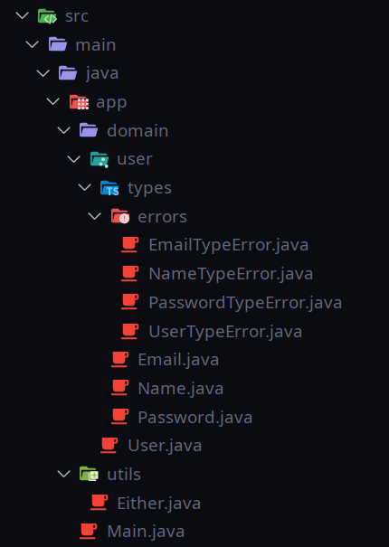

# Entity DDD

Case de estudo Entity DDD em Java, utilizando padrões de projetos e modelagem de domínio, baseado em uma Arquitetura Limpa, de acordo com ensinamentos de Martin Fowler em seu livro sobre refatoração e arquitetura limpa.

## Either

Either é uma classe externa do java que tem como principal finalidade o tratamento de erros de forma elegante.

👉 <a href="https://github.com/venzel/entity_ddd/blob/master/src/main/java/app/utils/Either.java">Either</a> 

## Pastas e arquivos

## Autor

Edivam Enéas de Almeida Júnior
